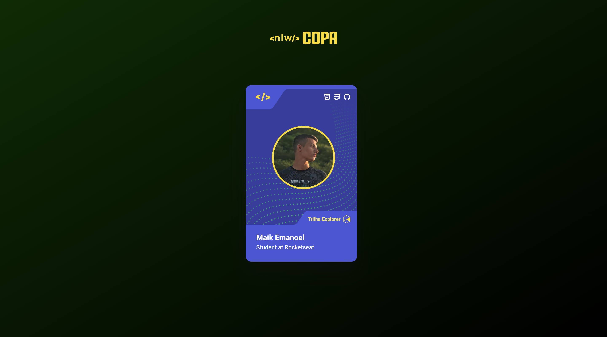

<h1 align="center"> NLW - Copa Card </h1>

[Clique aqui para acessar](https://maik-emanoel.github.io/nlw-copa-card/)

  <a href="#-tecnologias">Tecnologias</a>&nbsp;&nbsp;&nbsp;|&nbsp;&nbsp;&nbsp;
  <a href="#-projeto">Projeto</a>

## 🚀 Tecnologias

Esse projeto foi desenvolvido com as seguintes tecnologias:

- HTML
- CSS
- JavaScript

## 💻 Projeto

Neste projeto foi feito um cartão com o tema da Copa do Mundo 2022 para os alunos das Rocketseat. Ao clicar no cartão muda o tema da página.  

Obs: Projeto construído a partir do layout disponível nesse [vídeo](https://www.youtube.com/watch?v=sswJisbD2CY) do canal da [Rocketseat](https://rocketseat.com.br).